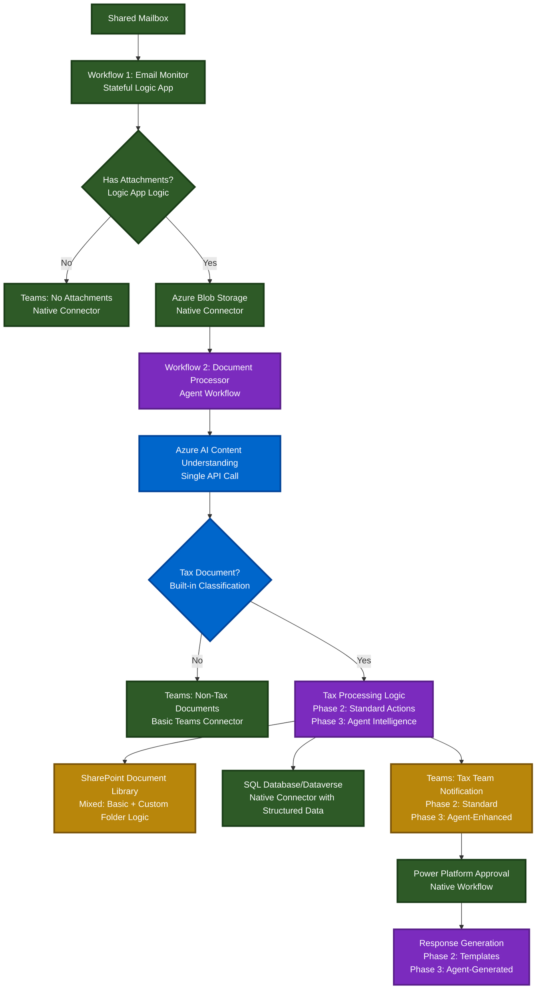

## 🎯 Key Benefits of This Two-Workflow Architecture

### Separation of Concerns
- **Workflow 1 (Email)**: Focused, reliable, permanent
- **Workflow 2 (Processing)**: Evolving, intelligent, adaptable
- **Clear boundaries**: Email handling vs. document processing

### Scalability & Reliability
- **Independent scaling**: Email and document processing scale separately
- **Fault isolation**: Email issues don't affect document processing
- **Built-in retry logic**: Handles transient failures in each workflow
- **Monitoring**: Application Insights integration for both workflows

### Evolution Path
- **Phase 2**: Working tax document processing with basic logic
- **Phase 3**: Enhance# Azure Tax Document Processing Architecture

# Azure Tax Document Processing Architecture (Two-Workflow Design)

## 🏗️ Recommended Azure Architecture

### Core Processing Flow (Two-Workflow Design with Agent Enhancement Path)


### Legend:
- **Dark Green**: Native Logic Apps connectors
- **Blue**: Azure AI Content Understanding (Single API)
- **Gold**: Mixed approach with enhanced capabilities
- **Purple**: Agent Workflow (evolves from basic to intelligent)

## 🛠️ Azure Technology Stack

### 1. Email Monitoring & Initial Processing
**Azure Logic Apps (Stateful) - Workflow 1**
- **Purpose**: Dedicated email monitoring and attachment extraction
- **Trigger**: Office 365 Outlook connector - "When a new email arrives"
- **Frequency**: Real-time (webhook-based)
- **Filter**: Monitor specific shared mailbox
- **Capabilities**: 
  - Extract attachments automatically
  - Handle multiple attachments per email
  - Built-in retry logic and error handling
- **Lifecycle**: Permanent - no changes required across phases

### 2. Document Storage & Management
**Azure Blob Storage (Hot Tier)**
- **Purpose**: Bridge between email processing and document analysis
- **Structure**: 
  ```
  /incoming/{year}/{month}/
  /processed/{year}/{month}/
  /tax-documents/{company}/{year}/
  /non-tax-documents/{year}/{month}/
  ```
- **Features**:
  - Automatic lifecycle management
  - Integration with AI services
  - Cost-effective for document storage
  - Triggers for downstream processing

### 3. Document Processing & Intelligence
**Azure Logic Apps (Agent Workflow) - Workflow 2**
- **Purpose**: Document analysis, classification, and business logic
- **Trigger**: Blob Storage trigger - "When blob is added"
- **Evolution Path**:
  - **Phase 2**: Standard Logic App actions within Agent workflow
  - **Phase 3**: Enhanced with Agent intelligence and reasoning
- **Why Agent Workflow**: Future-proofs for intelligent decision-making
- **Benefits**: 
  - Visual workflow design
  - Built-in enterprise monitoring
  - Seamless agent enhancement path

### 4. AI Document Classification & Analysis
**Azure AI Content Understanding**
- **Classification**: Built-in tax document identification
- **Extraction Methods**:
  - **Extract**: Specific data (amounts, dates, notice numbers)
  - **Classify**: Document types (IRS notices, state tax, etc.)
  - **Generate**: Summaries and risk assessments
- **Custom Analyzers**: Trained on your synthetic tax documents
- **Pro Mode Features**:
  - Multi-document reasoning
  - Cross-document validation
  - External knowledge base integration
- **Use Cases**:
  - Determine if document is tax-related
  - Extract comprehensive tax metadata
  - Generate summaries and recommended actions
  - Classify urgency and risk levels

### 5. Agent Intelligence (Phase 3 Enhancement)
**Azure Logic Apps Agent Features**
- **Agent Loop**: Iterative reasoning cycle (think-act-learn)
- **Integration**: Built on Semantic Kernel framework
- **Capabilities**:
  - Intelligent routing decisions
  - Dynamic response generation
  - Risk assessment reasoning
  - Contextual approval logic
- **Tools**: Convert Logic App actions into agent tools
- **Governance**: Enterprise-grade monitoring and compliance

### 6. Data Storage & Management
**Microsoft Dataverse** (Recommended)
- **Benefits**: 
  - Native Power Platform integration
  - Built-in security and compliance
  - Automatic API generation
  - Rich relationship modeling
- **Tables**:
  - Tax Documents
  - Tax Authorities
  - Processing History
  - Approval Workflows

**Alternative: Azure SQL Database**
- If existing SQL infrastructure preferred
- Use with Logic Apps SQL connector

### 7. Document Library Integration
**SharePoint Online**
- **Document Libraries**: Organized by tax type/year
- **Metadata**: Auto-populated from Content Understanding processing
- **Security**: Restricted to Tax Team access
- **Search**: Enhanced with extracted metadata
- **Custom Logic**: Folder structure and naming conventions (minimal custom code)

### 8. Communication & Workflow
**Microsoft Teams**
- **Tax Team Channel**: Actionable notifications with rich data
- **Unprocessed Channel**: Non-tax documents for review
- **Phase Evolution**:
  - **Phase 2**: Standard Teams notifications
  - **Phase 3**: Agent-enhanced adaptive cards with intelligent content

**Power Platform**
- **Power Automate**: Advanced approval workflows
- **Power Apps**: Tax team dashboard and management interface
- **Integration**: Seamless connection with both Logic App workflows

## 📋 Detailed Implementation Plan

### Phase 1: Email Monitoring Logic App

```json
{
  "definition": {
    "triggers": {
      "When_a_new_email_arrives": {
        "type": "ApiConnection",
        "inputs": {
          "host": {
            "connection": {
              "name": "@parameters('$connections')['office365']['connectionId']"
            }
          },
          "method": "get",
          "path": "/v2/Mail/OnNewEmail",
          "queries": {
            "folderPath": "Inbox",
            "fetchOnlyWithAttachment": true,
            "includeAttachments": true
          }
        }
      }
    },
    "actions": {
      "Check_for_attachments": {
        "type": "Condition",
        "expression": {
          "@greater(length(triggerBody()?['Attachments']), 0)"
        },
        "actions": {
          "yes": {
            "Process_attachments": {
              "type": "Foreach",
              "foreach": "@triggerBody()?['Attachments']",
              "actions": {
                "Upload_to_blob": {
                  "type": "ApiConnection",
                  "inputs": {
                    "host": {
                      "connection": {
                        "name": "@parameters('$connections')['azureblob']['connectionId']"
                      }
                    },
                    "method": "post",
                    "path": "/v2/datasets/default/files",
                    "body": "@items('Process_attachments')?['ContentBytes']"
                  }
                }
              }
            }
          }
        },
        "else": {
          "Send_no_attachments_message": {
            "type": "ApiConnection",
            "inputs": {
              "host": {
                "connection": {
                  "name": "@parameters('$connections')['teams']['connectionId']"
                }
              },
              "method": "post",
              "path": "/v1.0/teams/{teamId}/channels/{channelId}/messages",
              "body": {
                "body": {
                  "content": "Email received with no attachments from: @{triggerBody()?['From']}"
                }
              }
            }
          }
        }
      }
    }
  }
}
```

### Phase 2: Content Understanding Integration

**Content Understanding API Call**
```json
{
  "Analyze_with_Content_Understanding": {
    "type": "Http",
    "inputs": {
      "method": "POST",
      "uri": "https://your-region.cognitiveservices.azure.com/contentunderstanding/analyzers/tax-document-analyzer:analyze?api-version=2025-01-01-preview",
      "headers": {
        "Content-Type": "application/json",
        "Ocp-Apim-Subscription-Key": "@parameters('ContentUnderstandingKey')"
      },
      "body": {
        "analysisInput": {
          "documents": [
            {
              "source": "@variables('DocumentBlobUrl')",
              "kind": "url"
            }
          ]
        },
        "outputSchema": {
          "fields": [
            {"name": "documentType", "description": "Type of tax document (IRS Notice, State Tax, etc.)"},
            {"name": "isTaxDocument", "description": "Boolean indicating if this is a tax-related document"},
            {"name": "totalAmountDue", "description": "Total amount due in USD"},
            {"name": "dueDate", "description": "Payment due date"},
            {"name": "taxAuthority", "description": "Tax authority issuing the notice"},
            {"name": "noticeNumber", "description": "Official notice or reference number"},
            {"name": "companyName", "description": "Company or taxpayer name"},
            {"name": "ein", "description": "Employer Identification Number"},
            {"name": "riskLevel", "description": "Risk assessment: Low, Medium, High, Critical"},
            {"name": "recommendedAction", "description": "Recommended next steps"}
          ]
        }
      }
    }
  }
}
```

### Phase 3: Tax Processing Logic App

```json
{
  "definition": {
    "triggers": {
      "When_blob_is_added": {
        "type": "ApiConnection",
        "inputs": {
          "host": {
            "connection": {
              "name": "@parameters('$connections')['azureblob']['connectionId']"
            }
          },
          "method": "get",
          "path": "/datasets/default/triggers/batch/onupdatedfile"
        }
      }
    },
    "actions": {
      "Analyze_with_Content_Understanding": {
        "type": "Http",
        "inputs": {
          "method": "POST",
          "uri": "https://your-region.cognitiveservices.azure.com/contentunderstanding/analyzers/tax-document-analyzer:analyze?api-version=2025-01-01-preview",
          "body": {
            "analysisInput": {
              "documents": [{"source": "@triggerBody()?['Path']", "kind": "url"}]
            }
          }
        }
      },
      "Check_if_tax_document": {
        "type": "Condition",
        "expression": {
          "@equals(body('Analyze_with_Content_Understanding')?['result']?['documents'][0]?['fields']?['isTaxDocument']?['value'], true)"
        },
        "actions": {
          "yes": {
            "Notify_tax_team": {
              "type": "ApiConnection",
              "inputs": {
                "host": {
                  "connection": {
                    "name": "@parameters('$connections')['teams']['connectionId']"
                  }
                },
                "method": "post",
                "path": "/v1.0/teams/{taxTeamId}/channels/{channelId}/messages",
                "body": {
                  "body": {
                    "content": "🏛️ **Tax Document Received - Processing Started**\n\n**Document Type:** @{body('Analyze_with_Content_Understanding')?['result']?['documents'][0]?['fields']?['documentType']?['value']}\n**Amount:** $@{body('Analyze_with_Content_Understanding')?['result']?['documents'][0]?['fields']?['totalAmountDue']?['value']}\n**Due Date:** @{body('Analyze_with_Content_Understanding')?['result']?['documents'][0]?['fields']?['dueDate']?['value']}\n**Risk Level:** @{body('Analyze_with_Content_Understanding')?['result']?['documents'][0]?['fields']?['riskLevel']?['value']}\n\n[View Document](sharepoint_url) | [Review Details](power_app_url)"
                  }
                }
              }
            },
            "Save_to_SharePoint": {
              "type": "ApiConnection",
              "inputs": {
                "host": {
                  "connection": {
                    "name": "@parameters('$connections')['sharepointonline']['connectionId']"
                  }
                },
                "method": "post",
                "path": "/datasets/{site}/files",
                "body": "@triggerBody()"
              }
            },
            "Create_tax_record": {
              "type": "ApiConnection",
              "inputs": {
                "host": {
                  "connection": {
                    "name": "@parameters('$connections')['commondataservice']['connectionId']"
                  }
                },
                "method": "post",
                "path": "/v2/datasets/{environment}/tables/tax_documents/items",
                "body": "@body('Analyze_with_Content_Understanding')?['result']?['documents'][0]?['fields']"
              }
            }
          }
        },
        "else": {
          "Send_to_unprocessed": {
            "type": "ApiConnection",
            "inputs": {
              "host": {
                "connection": {
                  "name": "@parameters('$connections')['teams']['connectionId']"
                }
              },
              "method": "post",
              "path": "/v1.0/teams/{unprocessedTeamId}/channels/{channelId}/messages",
              "body": {
                "body": {
                  "content": "📄 **Non-Tax Document Received**\n\n**From:** @{triggerBody()?['From']}\n**Subject:** @{triggerBody()?['Subject']}\n**Analysis:** @{body('Analyze_with_Content_Understanding')?['result']?['documents'][0]?['fields']?['documentType']?['value']}\n\n[Review Document](blob_url)"
                }
              }
            }
          }
        }
      }
    }
  }
}
```

## 🎯 Key Benefits of This Architecture

### Scalability & Reliability
- **Serverless**: Auto-scales based on email volume
- **Built-in retry logic**: Handles transient failures
- **Error handling**: Comprehensive exception management
- **Monitoring**: Application Insights integration

### Cost Optimization
- **Pay-per-execution**: Only costs when processing emails
- **Blob storage**: Cost-effective document storage
- **Single AI service**: Content Understanding handles all analysis
- **Reduced custom development**: Minimal custom APIs needed

### Security & Compliance
- **Azure AD integration**: Secure authentication
- **RBAC**: Role-based access control
- **Data encryption**: At rest and in transit
- **Audit trails**: Complete processing history

### Integration Capabilities
- **Native connectors**: 400+ out-of-the-box connectors
- **Power Platform**: Seamless workflow integration
- **Content Understanding**: Single API for all document analysis
- **Real-time processing**: Immediate notifications

### Content Understanding Advantages
- **Generative AI-powered**: Better handling of document variations
- **No model training**: Works with diverse tax document formats
- **Built-in classification**: Automatically identifies tax documents
- **Rich extraction**: Extract, classify, and generate insights
- **Pro mode**: Multi-document reasoning and validation

## 📊 Monitoring & Analytics

### Application Insights Dashboard
- **Processing metrics**: Success/failure rates
- **Performance monitoring**: Processing times
- **Error tracking**: Failed classifications
- **Usage analytics**: Volume trends

### Power BI Reports
- **Tax document trends**: Types, amounts, frequencies
- **Processing efficiency**: Time to resolution
- **Team workload**: Distribution and backlogs
- **Compliance tracking**: Due dates and responses

## 🚀 Implementation Timeline

### Week 1-2: Foundation
- Set up Logic Apps and storage accounts
- Configure shared mailbox monitoring
- Implement basic attachment extraction

### Week 3-4: Content Understanding Integration
- Set up Azure AI Content Understanding service
- Create custom tax document analyzer
- Configure field extraction schema for tax metadata
- Test with synthetic tax documents

### Week 5-6: Workflow Integration
- Connect SharePoint and Dataverse with structured data
- Set up enhanced Teams notifications
- Implement Power Platform approval workflows

### Week 7-8: Testing & Refinement
- Use synthetic documents for end-to-end testing
- Refine Content Understanding analyzer accuracy
- Optimize notification templates and approval flows

This architecture provides a robust, scalable, and maintainable solution that leverages Azure Content Understanding's advanced capabilities while integrating seamlessly with your existing Microsoft 365 environment. The simplified approach reduces development time from months to weeks while providing superior document analysis capabilities.